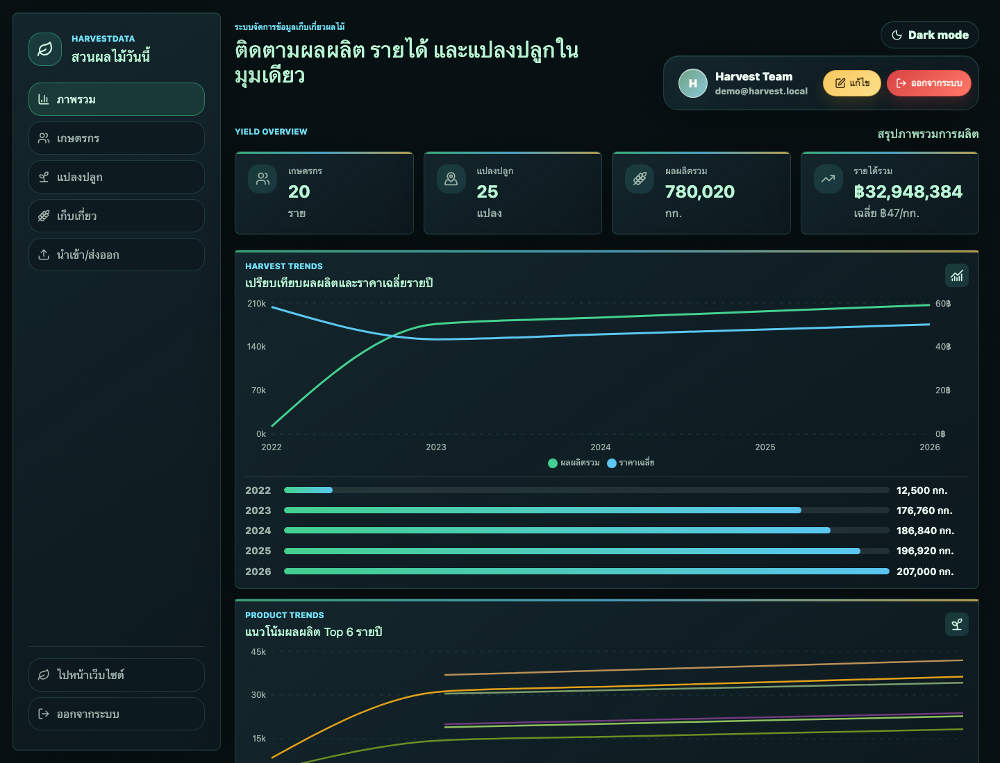
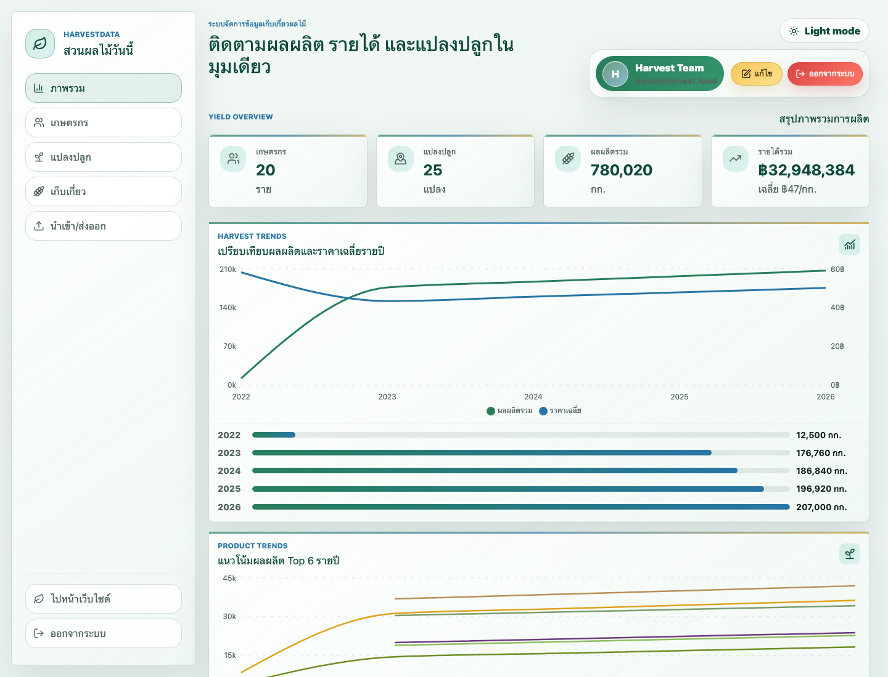
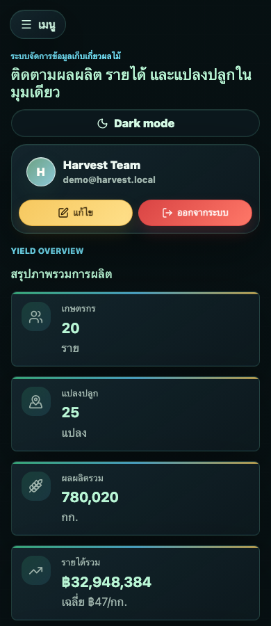

# HarvestData Frontend

<p align="center">
  
</p>

<p align="center">
  <strong>Next.js dashboard สำหรับสำรวจข้อมูลสวนผลไม้ เกษตรกร แปลงปลูก ผลผลิต รายได้ แผนที่จังหวัด และ CSV data transfer workflow</strong>
</p>

<p align="center">
  
  
  
  
  
</p>

HarvestData Frontend คือหน้าบ้านของระบบจัดการข้อมูลสวนผลไม้ที่เชื่อมกับ Django REST API ผ่าน session authentication ตัว dashboard ออกแบบให้เป็น operational tool ใช้จริงได้ตั้งแต่ดูภาพรวม, ค้นหา/แก้ไขข้อมูล, วิเคราะห์แนวโน้ม, ดูพื้นที่ปลูกบนแผนที่ประเทศไทย, ไปจนถึง preview/commit CSV import และ export dataset กลับไปทำงานต่อใน spreadsheet

## Gallery

| Dashboard | Light Mode |
| --- | --- |
|  |  |

| Mobile Experience |
| --- |
|  |

## Table of Contents

- [Frontend at a Glance](#frontend-at-a-glance)
- [Experience Map](#experience-map)
- [Quick Start](#quick-start)
- [Demo Accounts](#demo-accounts)
- [Environment Variables](#environment-variables)
- [Application Routes](#application-routes)
- [Dashboard Features](#dashboard-features)
- [API Client Contract](#api-client-contract)
- [Import/Export UI](#importexport-ui)
- [Scripts](#scripts)
- [Quality Checks](#quality-checks)
- [Project Structure](#project-structure)
- [Troubleshooting](#troubleshooting)

## Frontend at a Glance

| Area | Details |
| --- | --- |
| Framework | Next.js 16 App Router |
| UI runtime | React 18 client components |
| Styling | Global CSS + Tailwind config |
| Charts | Recharts |
| Map | `@svg-maps/thailand` + D3 color scaling |
| Icons | `lucide-react` |
| Toasts | `sonner` |
| Auth | Django session cookie + CSRF token |
| API default | `http://localhost:8000/api/v1` |
| Tests | Node test runner for API client |

## Experience Map

```text
Landing Page
    |
    v
Login Page
    |
    +-- regular user --> Dashboard
    |                    +-- Overview analytics
    |                    +-- Farmers CRUD
    |                    +-- Plantings CRUD + Thailand map
    |                    +-- Harvest records CRUD
    |                    +-- CSV import/export
    |
    +-- admin user ----> Admin Center
                         +-- Harvest years master data
                         +-- Fruit crops master data
                         +-- Admin profile
```

## Quick Start

Start the backend first:

```bash
cd ../backend
source .venv/bin/activate
python manage.py runserver 8000
```

Then run the frontend:

```bash
cd ../frontend
npm install
npm run dev
```

Open:

```text
http://localhost:3000
```

## Demo Accounts

| Role | Username | Password | Destination |
| --- | --- | --- | --- |
| User | `demo` | `demo1234` | Main Dashboard |
| Admin | `admin` | `admin1234` | Admin Center |

The demo accounts are created by the backend command:

```bash
cd ../backend
python manage.py seed_harvest_demo
```

## Environment Variables

Frontend reads the backend URL from:

```bash
NEXT_PUBLIC_API_BASE_URL=http://localhost:8000/api/v1
```

Run with a custom API:

```bash
NEXT_PUBLIC_API_BASE_URL=http://127.0.0.1:8000/api/v1 npm run dev
```

When changing frontend origin or port, also update backend CORS/CSRF variables:

```bash
DJANGO_CORS_ALLOWED_ORIGINS=http://localhost:3000
DJANGO_CSRF_TRUSTED_ORIGINS=http://localhost:3000
```

## Application Routes

| Route | Purpose |
| --- | --- |
| `/` | Main dashboard for authenticated regular users |
| `/?view=landing` | Public landing experience |
| `/login` | Session login page |
| `/admin` | Admin Center for staff/superuser accounts |

## Dashboard Features

### Overview

- KPI cards: farmers, plantings, harvest records, quantity, revenue, average price
- Harvest trend by year
- Product/fruit breakdown
- Product trend by year
- Farmer trend drilldown
- Top farmers by revenue
- Recent harvest activity

### Farmers

- Searchable farmer table
- Create/edit/delete farmer profiles
- Farmer image upload as data URL
- Confirmation modal before destructive actions
- Pagination for dense lists

### Plantings

- Create/edit/delete planting records
- Link planting to farmer and fruit master data
- Track variety, area, planting date, province, district, subdistrict, note
- Thailand planting map with D3-scaled province intensity
- Province detail panel with farmers, crops, quantity, revenue, and planted area

### Harvests

- Create/edit/delete harvest records
- Filter by year and search farmer/fruit/variety
- Revenue is derived from quantity and price
- Paginated table for repeated operational use

### Admin Center

- Staff/superuser-only route
- Manage harvest years
- Manage fruit crops, categories, and chart colors
- Edit admin profile
- Dark/light theme support

## API Client Contract

The shared API helper lives in:

```text
app/api-client.mjs
```

It provides:

| Helper | Purpose |
| --- | --- |
| `API_BASE_URL` | Reads `NEXT_PUBLIC_API_BASE_URL` or falls back to localhost |
| `apiUrl(path)` | Prefixes relative API paths and preserves absolute URLs |
| `getCookie(name)` | Reads browser cookies for CSRF handling |
| `apiRequest(path, options)` | Fetch wrapper with credentials, JSON body, CSRF header, error normalization, pagination support |

Important behavior:

- All API requests use `credentials: "include"`
- Non-GET requests attach `X-CSRFToken` when `csrftoken` exists
- DRF paginated list responses return `payload.results`
- `fetchAllPages: true` follows `next` links up to 100 pages
- API errors are thrown as `Error` objects with `status`

Example:

```js
const farmers = await apiRequest("/farmers/", { fetchAllPages: true });

await apiRequest("/farmers/", {
  method: "POST",
  body: {
    first_name: "มาลี",
    last_name: "สวนดี",
    phone: "0812345678",
  },
});
```

## Import/Export UI

The transfer screen wraps the backend CSV workflow into a safer UI:

1. Download template ZIP
2. Choose dataset: farmers, plantings, harvests
3. Upload one CSV
4. Preview rows and validation errors
5. Download error report CSV when needed
6. Commit valid import
7. Export all data as ZIP or filtered CSV

Supported export filters:

| Filter | Applies To |
| --- | --- |
| `dataset` | all, farmers, plantings, harvests |
| `year` | harvest export |
| `fruit` | planting/harvest export |
| `farmer` | planting/harvest export |

## Scripts

| Command | Purpose |
| --- | --- |
| `npm run dev` | Start Next.js dev server |
| `npm run build` | Create production build |
| `npm run start` | Serve production build |
| `npm run lint` | Run ESLint |
| `npm test` | Run Node tests in `app/*.test.mjs` |

## Quality Checks

Recommended local check before handing off UI work:

```bash
cd frontend
npm run lint
npm test
npm run build
```

Current frontend test coverage focuses on:

- API URL construction
- Fetch credentials
- Paginated DRF response loading

## Project Structure

```text
frontend/
├── app/
│   ├── page.js
│   ├── login/
│   │   └── page.js
│   ├── admin/
│   │   └── page.js
│   ├── api-client.mjs
│   ├── api-client.test.mjs
│   ├── globals.css
│   ├── layout.js
│   └── toaster.js
├── public/
│   ├── landing/
│   │   ├── harvest-satellite-hero.png
│   │   ├── dashboard-preview.png
│   │   ├── dashboard-light-preview.png
│   │   └── dashboard-mobile-preview.png
│   ├── next.svg
│   └── vercel.svg
├── eslint.config.mjs
├── next.config.mjs
├── package.json
├── tailwind.config.js
└── README.md
```

## Troubleshooting

### Login success แต่กลับไปหน้า login

Backend อาจยังไม่เปิด หรือ cookie ไม่ถูกส่งข้าม origin ให้เช็ก:

```text
http://localhost:8000/api/v1/auth/me/
```

และยืนยันว่า frontend ใช้:

```bash
NEXT_PUBLIC_API_BASE_URL=http://localhost:8000/api/v1
```

### POST/PATCH/DELETE ได้ CSRF error

เปิด backend ให้พร้อม แล้ว reload frontend เพื่อให้ `/auth/me/` ตั้งค่า `csrftoken` ใหม่ จากนั้นลอง login อีกครั้ง

### Dashboard ว่าง

ให้ seed data ฝั่ง backend:

```bash
cd ../backend
source .venv/bin/activate
python manage.py seed_harvest_demo
```

### Admin page เข้าไม่ได้

ต้องใช้บัญชี staff/superuser เช่น:

```text
admin / admin1234
```

### Import CSV preview แล้ว error เยอะ

เช็ก template ก่อนเสมอ:

- ชื่อ columns ต้องตรงตามไฟล์ template
- import ตามลำดับ farmers -> plantings -> harvests
- `fruit_name` ต้องมีใน Admin Center
- `year` ต้องมีใน Admin Center
- วันที่ต้องเป็น `YYYY-MM-DD`

## Notes for Future Work

Nice next upgrades:

- เพิ่ม tests สำหรับ transfer UI state
- เพิ่ม Playwright smoke test สำหรับ login/dashboard/admin
- แยก component dashboard ให้อ่านง่ายขึ้นเมื่อ feature โต
- เพิ่ม `.env.local.example` สำหรับ onboarding ที่ชัดกว่าเดิม
